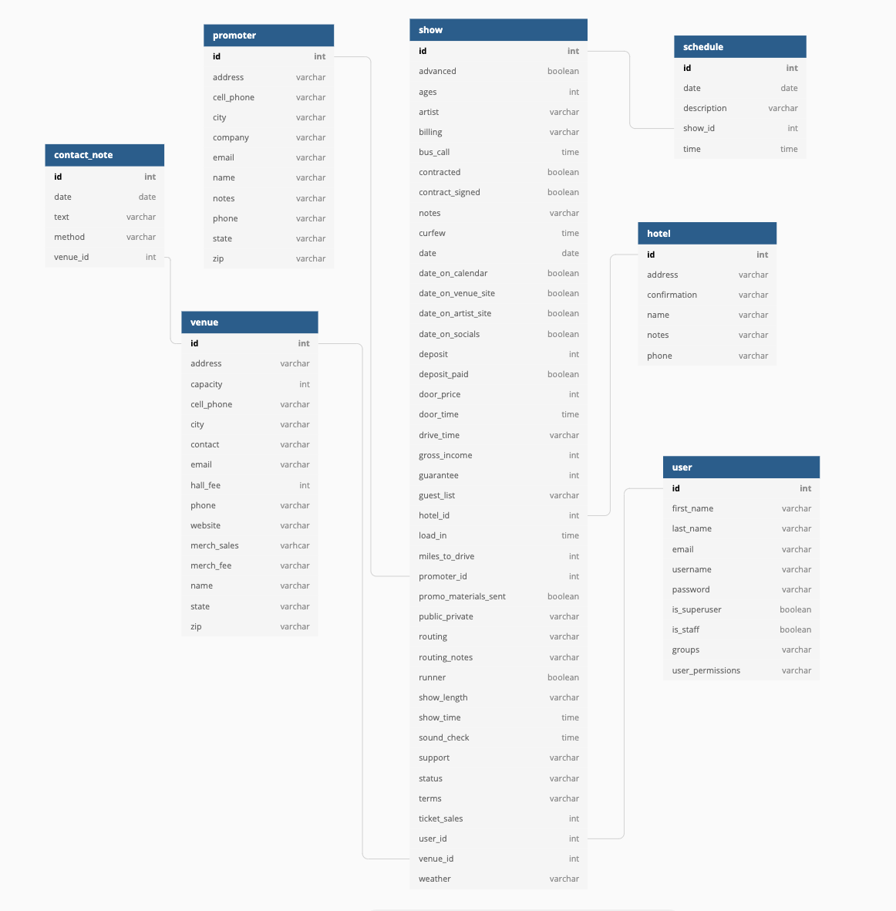

# The TM

## Description

The TM is an application designed to help tour managers keep track of relavent data to shows while reducing the need for repetative data entry. The user is able to easily navigate between shows and quickly update update information.

---

## Features
* Can register users and present unique data
* Complete CRUD functionality on shows, venues, promoters, schedule and contact notes
* Add new shows and keep track of:
    * Show details
    * Checklist of things to do
    * All related shows played at the venue
* Adding a new venue saves it to the database and gives the user access to quickly add the details to another show 
* Adding a new promoter saves it to the database and gives the user access to quickly add their details to another show 
* Users can add schedule entries related to the show
* Users can keep track of communications with the venue

---

## ERD and Wireframe

[View in dbdiagram](https://dbdiagram.io/d/609eae23b29a09603d14e96d)

[View wirefram in Figma](https://www.figma.com/file/A41DJnuQO4mRJpJatT67Bm/Untitled?node-id=7%3A549)

---

## Installation

1. Clone this repository to your machine
3. [Run the server](https://github.com/calebsjames/theTM)
3. Run `npm start` from the root directory to launch app

---

### Future features to include:

* Daysheets
    * Users will be able to enter a range of dates and print a PDF form for daysheets
* Settlement
    * Users will be able to enter income and expenses
    * Users will be able to print a PDF summany of the settlement
* Merchandise
    * Users will have full CRUD functionality on merchandise information
    * Users will be able to track sales and income
* Users
    * Admin
        * Invite general users to view relevant data related to upcoming shows
    * General 
        * Users will be able to view daysheet information online
